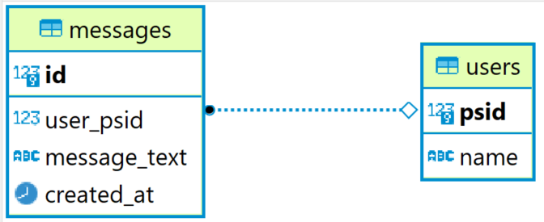

# Facebook Birthday Bot
-------

Facebook Messenger Bot that created using Javascript for asking question that related to birthday and can persist it's user message history in database.

## Features
-------

1. Rule-based Facebook (FB) Messenger Bot that stricly following these rules
   1. When a user starts a conversation, say `Hi` and then bot ask a few questions.
   2. Bot ask User's first name and user answer it.
   3. Bot User’s birthdate and user answer it with format `YYYY-MM-DD`.
   4. Ask if the user wants to know how many days till his next birthday that has two button there (`yes` and `no`). 
        - If the user select **yes** to the last question, send him a message: 
        `There are <N> days left until your next birthday`.
        - If the user select **no**, just say: `Goodbye 👋`.
2. Saving message / chat from user into the database.
3. Having API endpoints for accessing those saved messages.
   1. `/messages` that list all messages received from users
   2. `/messages/:id` to view single message by its ID
   3. `/summary` to view this data exact data
   ```
   [
       { user: <user_psid>, name: <user_name>, messages: [<list_of_users_messages>] }
       { user: <user_psid>, name: <user_name>, messages: [<list_of_users_messages>] }
   ]
   ```

## Stack Used

### Application
-------

1. **Node.js** (personally use v14.8.0) with **NPM** (I use v6.14.7) as package manager
2. **PostgreSQL** (personally use v12.1)

### Library
-------

#### Main Dependency
-------

1. **axios** (v0.27.2)
2. **body-parser** (v1.20.0)
3. **dotenv** (v16.0.1)
4. **express** (v4.18.1)
5. **pg** (v8.7.3)

#### Development Dependency
-------

Used for testing, linting, and hot-restarting server / app.

1. **chai** (v4.3.6)
2. **eslint** (v8.9.0)
3. **nodemon** (v2.0.15)
4. **supertest** (v6.2.4)

## How to Setup
-------

1. Install required applications that listed above.
2. Prepare the database (and account) to be used.
3. Setup for the messaging bot in Facebook, you can use [this](https://developers.facebook.com/docs/messenger-platform/getting-started/quick-start/) for reference.
4. Create `.env` file in the root directory of the project. And fill the file with these contents.
   ```
   SERVER_PORT=<>

   PGHOST=<>
   PGPORT=<>
   PGUSER=<>
   PGPASSWORD=<>
   PGDATABASE=<>

   PAGE_ACCESS_TOKEN=<>
   VERIFY_TOKEN=<>
   ```
   change these `<>` values with desired unused and valid port number, DB and FB (`PAGE_ACCESS_TOKEN` & `VERIFY_TOKEN`) creds that you already created.
5. Install libraries for the project using `npm install`.
6. Migrate DB schema using `npm run reset-postgres` or `migrate-up-postgres`.
7. Run app / server using `npm start`.
9. For exposing to the FB, you can use various ways, such as deploying the server or use `ngrok`.
10. Set the webhook URL in FB page, for more detail, look at the reference on step number 3.

The application / server should be ready to use.

## Model Data Used
-------

Because it's in Javascript, actually data structures in the program is schemaless (just using JS object). However, based on the data representation on database, here are the data structures that being used.

1. **users**
   ```
   psid BIGINT NOT NULL UNIQUE,
   name VARCHAR(255) NOT NULL,
   PRIMARY KEY(psid)
   ```
2. **messages**
   ```
   id serial PRIMARY KEY,
   user_psid BIGINT NOT NULL,
   message_text TEXT NOT NULL,
   created_at TIMESTAMP WITH TIME ZONE DEFAULT CURRENT_TIMESTAMP,
   FOREIGN KEY (user_psid) REFERENCES users(psid) ON DELETE CASCADE ON UPDATE CASCADE
   ```

And this is the visualization of model using ERD.

)

So, `users` has one-to-many relationship with `messages`.

## Tests
-------

So far, the integration tests has been implemented for the API.

## What can be Improved / Implemented Next
-------

- [ ] Centralized log
- [ ] More bot interraction
- [ ] More intelligent bot, maybe using NLP 

## Contributor
-------

- [Naufal Prima Yoriko](https://linkedin.com/in/naufal-prima-yoriko)
